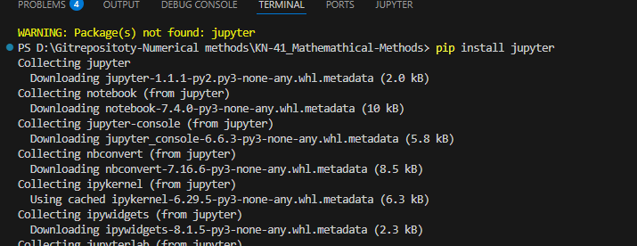
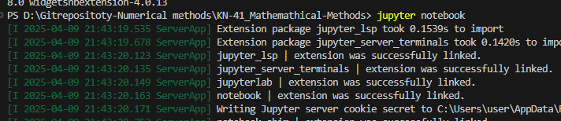
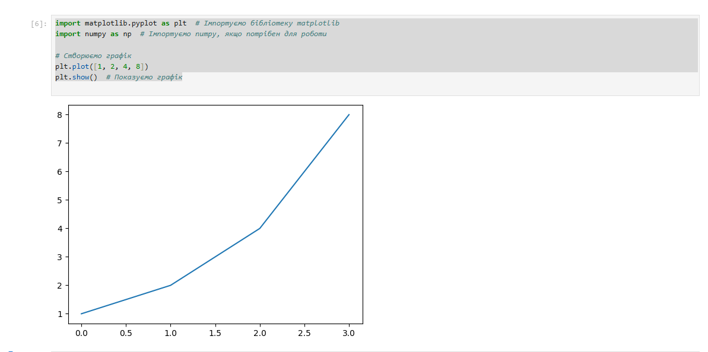
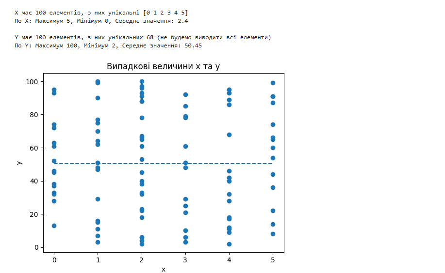
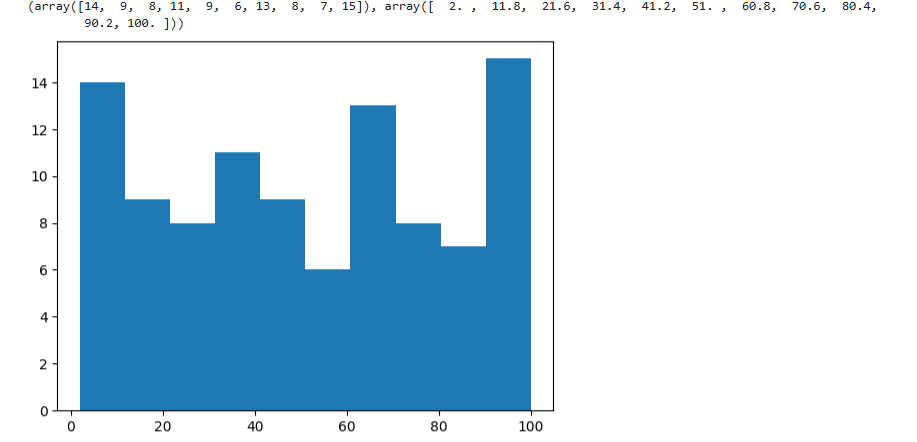
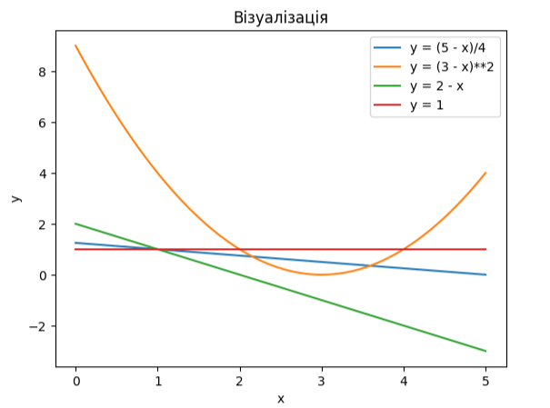

# Звіт до роботи 1
## Тема: Візуалізація результатів дослідження
### Мета роботи: налаштувати середовище, та оформити звіт

---
### Виконання роботи
* Результати виконання завдання *1...N*;
    1. Розробив репозиторій [посилання на нього](https://github.com/VasylynaYurij/KN-41_Mathemathical-Methods)
    1. Ми встановили Jupyter 
    1. Ми зайшли в Jupyter Notebook
    1. Навчився працювати з репозиторієм та налаштував інтеграцію з Visual Studio Code.
    1. Написав [першу програму та запустив її](./my_app.ipynb). Програма вивела графік, представлений на скріншоті:
    
    1. Написав [другу програму та запустив її](./my_app.ipynb). Програма вивела статистику по згенерованим випадковим даним та графік розсіювання, представлений на скріншоті:
    
    1. Написав [третю програму та запустив її](./my_app.ipynb). Програма вивела гістограму, представлений на скріншоті:
    
    1. Написав [четверту програму та запустив її](./my_app.ipynb). Програма вивела кілька математичних функцій на одному графіку, представлений на скріншоті:
    

   
---
### Висновок:

- У цій роботі було розроблено програму для виведення графіків та обробки даних. Також я створив репозиторій для зберігання коду та зображень, який буде доповнюватись новими програмами.
- Так, мету було досягнуто, я успішно створив репозиторій, додав декілька програм, і заповнив звіт.
- Я дізнався, як працювати з Git та репозиторіями, підвищив навички написання програм на Python і з графічними бібліотеками, а також став більш обізнаним у використанні Visual Studio Code для програмування.
- Так, усі питання були виконані, і звіт заповнений.
- Завдання поки що не є складними, тому я зміг виконати їх добре.
- Ні, не виникло проблем, все було зрозуміло, якщо знати основи.
- Це мій перший досвід роботи з таким підходом, і я знайомлюсь з новими інструментами, такими як Jupyter Notebook і бібліотеки для візуалізації.
- Все влаштовує, залишаю все як є.

---